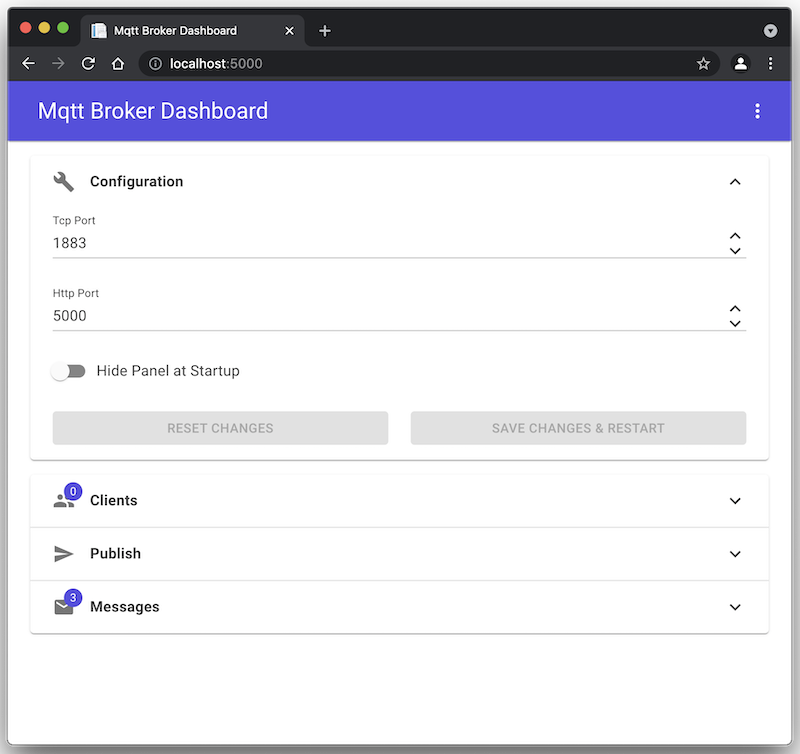

# Mqtt Broker w/ Dashboard

A simple Server-side Application hosting a Mqtt Broker and Dashboard UI for real-time monitoring using [ASP.NET Blazor Server](https://dotnet.microsoft.com/apps/aspnet/web-apps/blazor) to quickly build and test custom Mqtt infrastructure.

## Run in CLI

1. Install [Microsoft .NET SDK 6.0](https://dotnet.microsoft.com/download)

2. Clone Project from GitHub

3. Start Host from CLI (in Project Root Folder)

    `$ dotnet run`

4. Access Dashboard UI in Browser: http://localhost:5000

## Run in Docker Container

1. Install [Docker Desktop](https://docs.docker.com/desktop)

2. Clone Project from GitHub

3. Run as Docker Service (in Project Root Folder):

   `$ docker-compose up -d`

4. Access Dashboard UI in Browser: http://localhost:5000

## Configuration

Port configuration is stored in "HostConfig.json" and loaded at startup.

- Tcp Port: 1883 (regular _Mqtt over Tcp_)
- Http Port: 5000
   - "/"-endpoint serves Dashboard UI
   - "/mqtt"-endpoint serves _Mqtt over Websocket_

## Dependencies

- [MQTTnet](https://github.com/chkr1011/MQTTnet) Mqtt Library that supports Mqtt over WebSockets
- [MudBlazor](https://mudblazor.com) Material Design UI Framework for Dashboard Web Frontend
- [Json.NET](https://www.newtonsoft.com/json) Json Library to load/save Config File
